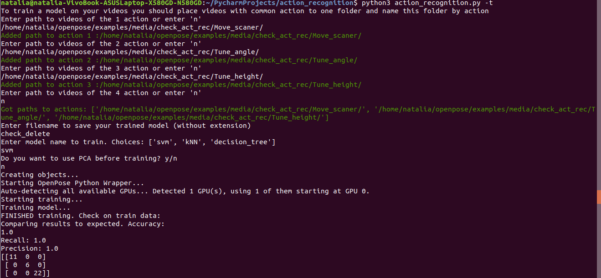
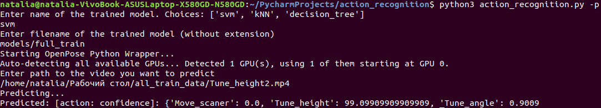

# Action recognition Command Line Interface (CLI)
## Tool description
  The aim of the work is to create a simple user interface to interact with machine learning methods of human actions evaluation based on skeleton poses provided by Openpose. Several methods for solving the problem are selected: SVM, kNN, decision tree. Training dataset was created to conduct the research and test the tool. Processing algorithms are developed and experimental studies are carried out, which showed that the selected methods are applicable for the task of evalusting actions, but require refinement and expansion of the dataset.
 ### Tool functionality
  --help , -h    show this help message and exit\
  --train, -t    start training model on new data, PCA available\
  --predict, -p  predict action on video using trained model, PCA available\
  --real_time_predict, -r predict action in RT using trained model\
  Optional parameter PCA serves for decreasing number of training parameters in the model.\

## Installation
   **1. Install OpenPose**  https://github.com/CMU-Perceptual-Computing-Lab/openpose/blob/master/doc/installation.md \
    Required:\
    CUDA (Nvidia GPU) version:\
    - NVIDIA graphics card with at least 1.6 GB available (the nvidia-smi command checks the available GPU memory in Ubuntu).\
    - At least 2.5 GB of free RAM memory \
    - Highly recommended: cuDNN. \
   **2. Install dependencies** from requirements.txt
## Define input data
  Input data to train models and predict is folders with videos *.mp4. Every video contains basically 1 action done by 1 person. Every folder contains videos with one action and is named by action name. Example: If you want to train the model to recognize 3 classes, you need to create 3 folders. 
  1. project_path/Move_scaner/ stores videos like this:  \
    
  2. project_path/Tune_height/ with videos:  \
    
  3. project_path/Tune_angle/ with videos:\
    
## Train model example

## Output data
After training the model you will find 2(3) files of trained model in your folder: model of the method itself (from example: models/full_train.sav), file with actions names (from example: models/full_train_classes.txt) and optionally PCA model .txt file. These files are neccesary to make predictions on new data.

## Prediction example

Output of the prediction is name of the action and model's confidence % in it's precense in the video.
